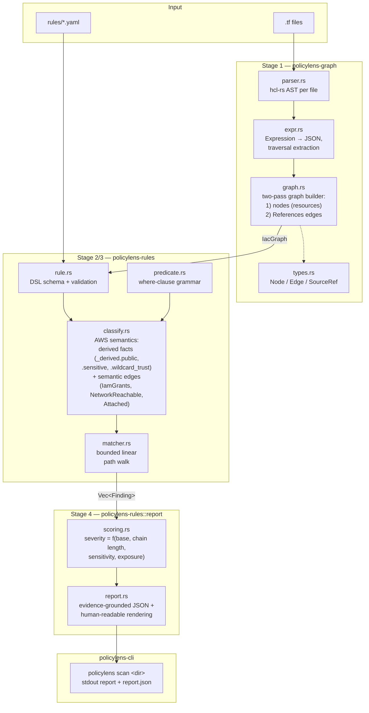

# PolicyLens

**A taint-aware Infrastructure-as-Code security scanner for Terraform that detects cross-resource attack chains, not just isolated single-resource misconfigurations.**

PolicyLens is architecturally derived from a static-analysis pipeline originally built for smart-contract security analysis (custom pattern DSL, structural matchers, evidence grounding across a three-stage pipeline), retargeted to Terraform infrastructure-as-code.

---

## Table of Contents

- [Problem Statement](#problem-statement)
- [Architecture](#architecture)
- [Getting Started](#getting-started)
- [The Rule DSL](#the-rule-dsl)
- [Severity Scoring](#severity-scoring)
- [Test Corpus](#test-corpus)
- [Design Decisions](#design-decisions)
- [Limitations](#limitations)

---

## Problem Statement

Conventional IaC scanners (Checkov, tfsec, and similar tools) evaluate each resource in isolation. *"This S3 bucket allows public access"* and *"this IAM role has a wildcard principal in its trust policy"* are reported as two independent, medium-priority findings — each easy to triage or dismiss on its own.

In practice, breaches rarely come from a single misconfigured resource. They come from **chains**: a public bucket, plus a role that can write to it, plus a trust policy that permits more than the intended principal to assume that role. Each condition is individually defensible; together, they form a complete compromise path.

### Concrete example

From this project's test corpus (`test-corpus/vuln-01-public-bucket-untrusted-role`):

```hcl
resource "aws_s3_bucket_public_access_block" "exports" {
  bucket = aws_s3_bucket.exports.id
  block_public_acls   = false   # flagged in isolation by a per-resource scanner
  block_public_policy = false
  ...
}

resource "aws_iam_role" "cross_account_writer" {
  assume_role_policy = jsonencode({
    Statement = [{ Effect = "Allow", Principal = { AWS = "*" }, ... }]
    # flagged in isolation, as a separate finding
  })
}

resource "aws_iam_role_policy" "writer_access" {
  role   = aws_iam_role.cross_account_writer.id
  policy = jsonencode({
    Statement = [{
      Action   = ["s3:PutObject", "s3:GetObject"]
      Resource = "${aws_s3_bucket.exports.arn}/*"
    }]
  })
}
```

A single-resource scanner reports two disconnected medium-severity findings. PolicyLens reports one HIGH-severity finding: **any principal in any AWS account can assume `cross_account_writer` and write into the publicly-exposed `exports` bucket** — with a complete, auditable evidence path connecting all three resources.

### Equally important: avoiding false positives

`test-corpus/safe-01-*` contains a bucket with a `public_access_block` resource present (which some scanners flag on sight) and a role using the identical `Principal.AWS = "*"` trust policy as the vulnerable example above. However, the access block explicitly blocks all public access, and the wildcard-trust role has no grant reaching that bucket. No chain exists, and PolicyLens correctly reports nothing.

Precision — finding real chains without inventing false ones — is treated as a first-class design requirement throughout this project. See [Test Corpus](#test-corpus) for the full false-positive-resistance suite.

---

## Architecture

PolicyLens is organized as a three-stage pipeline across three Cargo crates, each independently testable and independently responsible for one concern.



### Crate responsibilities

| Crate | Responsibility |
|---|---|
| `policylens-graph` | Parses Terraform HCL into a generic, provider-agnostic resource graph. Contains no AWS-specific semantics. This is the only crate with a dependency on `hcl-rs`. |
| `policylens-rules` | Owns the rule DSL, AWS-specific classification logic (what "public," "sensitive," and "over-permissive" mean), the path matcher, and severity scoring/reporting. |
| `policylens-cli` | Thin binary wiring the graph and rules crates together into a command-line interface. |

---

## Getting Started

### Prerequisites

- Rust (stable toolchain), installed via [rustup](https://rustup.rs)

### Running a scan

```bash
cargo run -p policylens-cli -- scan test-corpus/vuln-01-public-bucket-untrusted-role
```

This prints a human-readable report to stdout and writes a structured `policylens-report.json` (for CI consumption) to the current directory.

```
PolicyLens scan: test-corpus/vuln-01-public-bucket-untrusted-role
  4 resource(s), 4 edge(s), 2 unresolved attribute(s)

1 finding(s):
  HIGH: 1

[1] HIGH -- Publicly accessible storage is writable by a role with untrusted trust policy (score 78)
  rule: public-storage-writable-by-untrusted-role
  why this severity: base 70 (High) − hop penalty 0 (0 extra hop(s) beyond the first, capped at 20)
    + sensitivity bonus 0 (no sensitive-tagged resource in chain) + exposure bonus 8
    (chain includes a publicly-reachable entry point) = 78 -> HIGH
  chain (1 hop(s)):
    aws_iam_role.cross_account_writer
      --[IamGrants]--> aws_s3_bucket.exports
          evidence: aws_iam_role.cross_account_writer (via aws_iam_role_policy.writer_access,
            statement 0) is granted ["s3:PutObject", "s3:GetObject"] on aws_s3_bucket.exports
            (test-corpus/.../main.tf, attribute `policy.Statement[0]`)
```

### Running the test suite

```bash
cargo test --workspace
```

### Inspecting the graph directly

For debugging rule development or unexpected results, the raw (or classified) resource graph can be dumped as JSON:

```bash
cargo run -p policylens-cli -- debug-graph <dir> [--classified]
```

This is a diagnostic aid and is not part of the stable CLI contract.

---

## The Rule DSL

Rules are declared in `rules/*.yaml` as **linear graph-path patterns**: an alternating sequence of node-matchers and edge-matchers. The DSL deliberately does not support branching or general subgraph matching — every one of the five built-in rules is expressible as a straight-line path, and constraining the grammar to this shape is what keeps the matcher a simple, boundedly-terminating walk rather than a general (and potentially expensive) subgraph-isomorphism search.

```yaml
id: overly-permissive-role-sensitive-access
title: "IAM role has wildcard-scoped access to a sensitive resource"
severity_base: medium        # critical | high | medium | low
max_total_hops: 1            # hard cap enforced by the engine regardless of path length
path:
  - node:
      kind: IamRole           # matches a ResourceKind variant name,
      bind: role               # or the raw Terraform type string for unmodeled kinds
  - edge:
      kind: IamGrants          # References | IamTrust | IamGrants | Attached | NetworkReachable
      where: "_derived.grants_wildcard == true"
  - node:
      kind: S3Bucket
      where: "_derived.sensitive == true"
      bind: sensitive_bucket
```

### The `where:` predicate grammar

```
predicate := clause (' && ' clause)*
clause    := path op literal | path 'exists' | path 'not exists' | path 'contains' literal
path      := ident ('.' ident | '[' int ']')*
op        := '==' | '!=' | '>' | '>=' | '<' | '<='
literal   := 'true' | 'false' | number | '"quoted string"'
```

The grammar is deliberately restricted to conjunctions (AND-only, no OR, no parentheses). Every built-in rule is expressible as a conjunction of simple comparisons; the underlying complexity of a predicate like "is this bucket public" is resolved once in `classify.rs` and exposed as a precomputed `_derived.public` boolean, rather than encoded inline in the DSL. Extending the grammar to support disjunction is treated as a deliberate design decision to be made if a concrete rule requires it, not something to build ahead of need.

### Adding a new rule

1. **Add any missing derived fact.** If the rule depends on a fact not yet computed (for example, `_derived.encrypted` on an S3 bucket), add it in `policylens-rules/src/classify.rs`, following the pattern established by `derive_s3_bucket_facts` / `derive_iam_role_trust_facts`: read raw `node.attrs`, write a boolean under `node.attrs["_derived"]`, and document the reasoning behind the fact's definition.
2. **Add any missing edge kind.** If the rule requires a new semantic relationship, add a variant to `EdgeKind` in `policylens-graph/src/types.rs` and a corresponding classification function in `classify.rs` (see `compute_iam_grant_edges` / `compute_network_reachable_edges` for the established pattern: read existing `References` edges and node attributes, emit new semantic edges).
3. **Write the rule YAML** in `rules/`. Rules are validated at load time — the path must start and end on a node step, must strictly alternate between node and edge steps, and hop budgets must be satisfiable — so a malformed rule fails immediately with a specific error rather than silently matching nothing.
4. **Add test coverage.** At minimum, one vulnerable fixture and one "looks suspicious but is actually safe" fixture (see `policylens-rules/tests/rule_coverage.rs` for the pattern used for rules 2 and 4, which lack a dedicated top-level `test-corpus/` module), asserting the exact expected `rule_id` set.

---

## Severity Scoring

```
score = base(severity_base) − hop_penalty + sensitivity_bonus + exposure_bonus
```

The result is clamped to `0..=100` and mapped to a label: `≥85` Critical, `≥65` High, `≥40` Medium, otherwise Low. The complete rationale for each term is documented in `policylens-rules/src/scoring.rs`; summarized:

| Term | Value | Rationale |
|---|---|---|
| `base` | critical=90, high=70, medium=50, low=30 | The rule author's own baseline judgment of how dangerous this *class* of chain is, declared per-rule. |
| `hop_penalty` | 5 per edge beyond the first, capped at 20 | A longer chain requires more independent conditions to hold simultaneously, and is therefore less certain to be exploitable exactly as found — directly implementing the requirement that shorter chains to sensitive data score higher than long, improbable ones. Capped so a long-but-certain chain is not scored as trivial. |
| `sensitivity_bonus` | +10 | Applied if any node in the chain is tagged `sensitive = true`. |
| `exposure_bonus` | +8 | Applied if any node in the chain is directly internet-reachable (`_derived.public`, `.publicly_invokable`, or `.open_ingress`). A chain with a public entry point requires no prior foothold to exploit, unlike one reachable only from inside the account. |

Every finding's report includes the fully-expanded scoring explanation (see the CLI output example above), so the derivation of any given score is always answerable from the report itself, without cross-referencing source code.

---

## Test Corpus

`test-corpus/` contains eight modules, each documented with the specific scenario it verifies:

| Module | Category | Verifies |
|---|---|---|
| `vuln-01-public-bucket-untrusted-role` | Vulnerable | Rule 1 true positive |
| `vuln-02-privilege-escalation` | Vulnerable | Rule 5 true positive (self-loop pattern) |
| `vuln-03-unauthenticated-lambda-secret-access` | Vulnerable | Rule 3 true positive |
| `safe-01-public-bucket-but-locked-down-role` | Looks suspicious, is safe | Rule 1 false-positive resistance — access block present but blocks everything; wildcard-trust role has no grant to the bucket |
| `safe-02-wildcard-role-on-nonsensitive-bucket` | Looks suspicious, is safe | Rule 2 false-positive resistance — wildcard grant exists, but the target is not tagged sensitive |
| `safe-03-open-sg-instance-no-sensitive-access` | Looks suspicious, is safe | Rule 4 false-positive resistance — security group is genuinely open, but the instance role reaches nothing sensitive |
| `zero-01-single-private-bucket` | Zero-issue | No findings generated from a minimal, unremarkable configuration |
| `zero-02-least-privilege-role` | Zero-issue | Properly-scoped trust plus a properly-scoped grant to sensitive data is not, by itself, a chain |

Rules 2 and 4 have additional dedicated true-positive fixtures under `policylens-rules/tests/fixtures/` (`rule2-tp`, `rule4-tp`), since the top-level corpus was scoped to a minimum of three vulnerable modules, while the automated test suite requires true-positive coverage for all five rules.

All eight corpus modules, both supplementary true-positive fixtures, and every graph-construction and evidence-accuracy claim documented in this README are enforced by `cargo test --workspace` (29 tests total; see `policylens-rules/tests/corpus.rs` and `rule_coverage.rs`). Nothing in this document is asserted without corresponding test coverage.

---

## Design Decisions

**YAML for rule structure; a small hand-written grammar for `where:` predicates only.** YAML's native list/map syntax maps directly onto "an alternating sequence of typed steps," so a fully custom grammar for rule structure would only reimplement YAML with additional parsing overhead. The one genuinely novel piece of syntax — the predicate mini-language — is kept intentionally minimal.

**Edge direction is actor → target, not the order in which a rule path is written.** `IamGrants` edges point from the role holding a grant to the resource it can act on. This is a structural property of the graph, independent of how any given rule's path is authored — a rule matching the wrong direction will simply match nothing, with no error raised. Worth verifying explicitly when a new rule fails to match unexpectedly.

**`Instance → IamInstanceProfile → IamRole` is collapsed into one synthetic `Attached` edge** (`classify.rs::compute_attached_edges`), rather than requiring rule paths to spell out the instance-profile indirection explicitly. This is a deliberate ergonomic simplification for rule authoring, not a claim that PolicyLens treats instance profiles as a first-class graph concept.

**A missing `where:` path evaluates to `false`, not an error.** Combined with unresolved-interpolation tracking, this preserves a distinction between "evaluated and found to be fine" and "could not be determined" throughout the pipeline, rather than collapsing both into an undifferentiated "no finding."

**`hcl-rs` is pinned to `0.14.3`**, with its `pest` / `pest_meta` / `pest_derive` dependencies further pinned to `2.7.15`. This version predates `hcl-rs`'s source-span support, which is why evidence grounding is reported at `(file, resource_id, attribute_path)` granularity rather than exact source line numbers — see [Limitations](#limitations). Upgrading `hcl-rs` on a modern toolchain and reintroducing span-based evidence is a natural, low-risk enhancement rather than a redesign.

---

## Limitations

This section is maintained as an accurate account of current constraints, not an aspirational roadmap.

- **AWS only.** Supported resource types are limited to S3, IAM, Lambda, and EC2 security groups/instances. There is no GCP or Azure support, no RDS or other managed data-store coverage, and no VPC-level networking beyond security group ingress rules. This is a deliberate scope boundary, not a partial implementation of broader intended coverage.

- **No Terraform module traversal.** Only root-level `resource` blocks in a flat, non-recursive directory are parsed. `module "x" { source = ... }` blocks are not followed, and there is no remote state or `terraform.tfstate` reconciliation — this is pure static source analysis.

- **No variable or expression evaluation.** References such as `var.x`, unresolved `for_each` expressions, and function calls other than `jsonencode(...)` are recorded as explicit `"unresolved:..."` markers rather than approximated. The CLI reports a count of resources containing unresolved attributes so this is always visible rather than silent. This is the primary source of potential false negatives: a chain that only materializes once a variable is substituted with its runtime value will not be detected.

- **No exact source line numbers.** Evidence is grounded at `(file, resource_id, attribute_path)` granularity; see the `hcl-rs` version note under [Design Decisions](#design-decisions).

- **IAM policy statement resolution is best-effort for non-`jsonencode` authoring styles.** Policies written via `jsonencode({...})` (or an equivalent plain HCL object) receive precise per-statement resource resolution. Policies written as a single interpolated JSON string without `jsonencode` fall back to "any Resource reference anywhere in this policy," which can misattribute a grant's actions to the wrong statement when a policy holder declares multiple statements in that style. `jsonencode(...)` is by a wide margin the more common Terraform idiom, so this affects a narrow but real class of configurations.

- **`sensitive` and "public" are conventions defined by this tool, not AWS platform concepts.** `sensitive` is derived from a `tags.sensitive` (case-insensitive) truthy value; production deployments would typically want this tuned to an organization's actual tagging standard. "Public" for S3 buckets reflects AWS's current (post-2023) default-private behavior — the absence of a `public_access_block` or ACL resource is treated as not public. This is accurate for current AWS defaults, but would misclassify legacy buckets predating that default that never had an explicit block applied.

- **Action-based heuristics, not complete IAM semantics.** `grants_write`, `grants_wildcard`, and `grants_iam_escalation` are substring- and set-based heuristics over IAM action names (see the documented marker lists in `classify.rs`), not a complete model of the AWS IAM action namespace or of resource-based policy evaluation. Deny-overrides-allow interaction across multiple policies, permission boundaries, and service control policies are not modeled.

- **Duplicate resource addresses are a hard parse error by design.** PolicyLens requires resource addresses to be unique within a scanned directory and will not silently overwrite one definition with another. This means it cannot currently scan a directory containing multiple independent Terraform root modules that happen to reuse the same resource addresses; scans should target one root module at a time.

- **CI toolchain version parity is partially, not fully, verified.** The primary development environment for this project had no network access to install `rustup` or a current Rust toolchain, and was constrained to a distribution-packaged `rustc 1.75`. Formatting and lint fixes were subsequently verified against both that toolchain and a distribution-packaged `rustc 1.83`, which narrows but does not eliminate the gap against whatever current `stable` release CI's `dtolnay/rust-toolchain@stable` resolves to at any given time. `cargo fmt --all -- --check` and `cargo clippy --workspace --all-targets -- -D warnings` both pass under 1.75 and 1.83; a lint introduced in a stable release newer than 1.83 could still surface on a future CI run.
